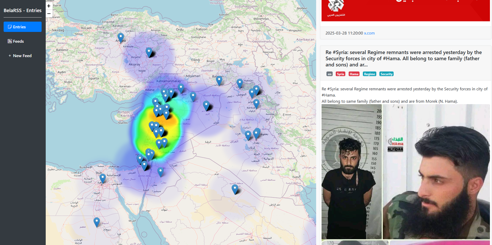

# belaRSS

belaRSS is a news Agrigator that collects news posts from a custom collection of feeds. Posts are updated every hour and are analysed using machine learning models to extract entities, georeference etc. 



# Features

## Entries
The entries page displays all the most recent entries. The number of entries are selected by: 
- The Number of entries to see 
- The starting point

## Feeds
Displays the feeds that are updated hourly, with basic information for each feed: number of posts etc. 

## New Feed
This is where you can add a new feed. So far belaRSS supports: 
- Twitter
- Instagram 
- RSS 
- Telegram 

# Machine Learning

## Autotagging: 

BelaRSS leverages the power of machine learning through open source models. 

- Language detection: Each post has its main language automatically detected

- Entity extraction: Each post gets its entities extracted: 
    - LOC: Locations (in red)
    - PER: Persons (in blue)
    - ORG: Organisations (in yellow)

## Georeferencing: 

If a post mentions locations then it is automatically georeferenced using google geolocation API. 

To access the google API console: https://console.cloud.google.com

## Installation

1. Clone the repository:
    ```bash
    git clone https://github.com/yourusername/belaRSS.git
    cd belaRSS
    ```

2. Create a virtual environment and activate it:
    ```bash
    python3 -m venv venv
    source venv/bin/activate
    ```

3. Install the required packages:
    ```bash
    pip install -r requirements.txt
    ```

4. Set up the database:
    ```bash
    python -c "from app import get_db; get_db().executescript(open('schema.sql').read())"
    ```

5. Run the application:
    ```bash
    python app.py
    ```


# RSSHUB 

You can install RSShub from git and run using pnmp start

````
pnpm add rsshub
pnmp start
````
RSShub runs on port 1200 (so all the links need to link to localhost:1200)

The .env file is saved in the RSShub folder

## Twitter
- Twitter either uses passwords
- Or auth token (may need to be changed once in a while)

## API Endpoints

## Templates

### `index.html`

The base template that includes the sidebar and main content area.

### `entries.html`

Template to display entries with pagination.

### `add_feed.html`

Form to add a new feed.


## Database

### `create_feed_view.sql`

SQL script to create a view that includes feed data along with the count of entries.

## Running the Application

To run the application, execute the following command:
```bash
python app.py
```

The application will be available at `http://localhost:5000`.

## License

This project is licensed under the MIT License.

## To commit to git: 
1. git add .
2. git commit -m "message"
3. git push origin main


## Crontab 

```
@reboot cd /home/jaddh/belaRSS/RSSHub && /home/jaddh/.local/share/pnpm/pnpm start pnmp
0 * * * * cd /home/jaddh/belaRSS && /home/jaddh/belaRSS/.venv/bin/python update.py
@reboot cd /home/jaddh/belaRSS && /home/jaddh/belaRSS/.venv/bin/python app.py
```